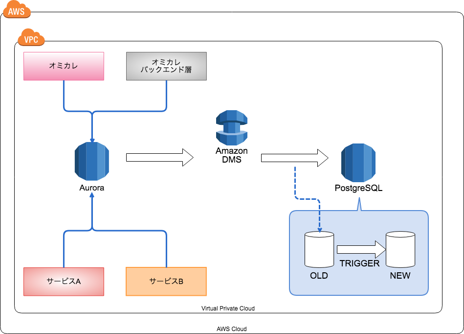
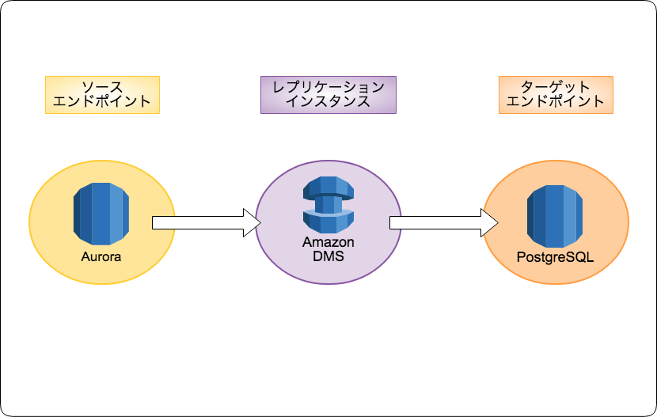

slidenumbers: true

## MySQL(Aurora)からPostgreSQLへのDB移行事例のご紹介

### 2018-09-23 OSC広島

---

# 概要

- **MySQL(AWS Aurora) から PostgreSQLへの異種間DB移行手法**
- **DBリファクタリングの実施方法**



---

# AWS DMSについて

**Database Migration Service**  <br>
データの移行を行う事が出来るサービス <br>

※ コピー元、コピー先のどちらかがAWSのエンドポイントであればレプリケーションをする事が出来る。



---
[.autoscale: true]

### AWS DMSのキーワード

- **ソースエンドポイント**
  - データのコピー元。 `EC2 on DB`, `RDS`, `オンプレDB`, `S3` など。
- **ターゲットエンドポイント**
  - データのコピー先。 `EC2 on DB`, `RDS`, `オンプレDB`, `S3`, `DynamoDB` など。
- **レプリケーションインスタンス**
  - レプリケーションを行うインスタンス
  - 内部にストレージを持っていてソースエンドポイントのデータをここに一時保存したりもする。

---
[.autoscale: true]

### AWS DMSのデータ移行の流れ

1. **フルロード**
  ソースDBからレプリケーションインスタンスにデータをフルロードして、ターゲットDBに書き込む。
1. **CDC(変更データキャプチャ)**
  フルロード後はトランザクションログを参照して継続的なレプリケーションを行う事が出来る。
  (フルロードのみ行うなども出来る。)
  


---
[.autoscale: true]

### AWS DMSのコピーテーブル指定の粒度

- **文字列一致での指定**
  **users** => `users` テーブルのみを対象とする。
- **正規表現での指定**
  **user_%** => `user_active`, `user_access_log` と正規表現に合致するテーブルのみを対象にする。

---
[.autoscale: true]

### MySQLからPostgreSQLへの移行プロジェクト

1. ソースエンドポイントに`MySQL`のデータベースを登録する。
1. ターゲットエンドポイントに`PostgreSQL`を登録する。
1. レプリケーションインスタンスを作成する。
1. 移行したいテーブルを適当なグループに分割してDMSのタスクを作成してレプリケーションする。
  例. **user_replication** => `user` と `user_〜` など.
1. ターゲットの`PostgreSQL`のテーブルにトリガーを指定してDBリファクタリングを実施する。(**一番やりたいこと**)

---

# トリガー設定構文について

```sql
CREATE TRIGGER 'トリガー名'
  trigger_time trigger_event 
  ON 'テーブル名' FOR EACH ROW '実行関数'

```

|  | MySQL | PostgreSQL |
| :--- | :--- | :--- |
| **trigger_time** | `BEFORE`, `AFTER` | `BEFORE`, `AFTER` |
| **trigger_event** | `INSERT`,`UPDATE`,`DELETE` から**一つ** | `INSERT`,`UPDATE`,`DELETE` から**1個以上** |

※ もっとあるけど、省略

---
[.autoscale: true]

# PostgreSQLの強み(手続き型言語)

| 名称 | 言語 | 配布方法 |
| :--- | :--- | :--- |
| PL/pgSQL | SQL | 基本配布 |
| PL/Perl | Perl | 基本配布 |
| PL/Python | Python | 基本配布 |
| PL/Java | Java | 拡張 |
| PL/v8 | JavaScript | 拡張 |
| ※ その他 | | |

---


---
